# Taller practico sobre Streamlit.

Este taller tiene como objetivo crear una aplicación de Streamlit en donde se pueda interactuar con modelos de inteligencia artificial generativa alojados en WatsonX, con una base de datos vectorial de ChromaDB y crear un RAG que permita consultar los documentos guardados en la base de datos vectorial.

## Prerrequisitos.
- Tener instalado Python. (La versión recomendada es **Python 3.11.9**. Esto debido a que en las versiones 3.12 y 3.13 se requiere descargar las Visual Studio Build Tools para poder instalar las dependencias de la app)
- (Opcional pero muy recomendable) Tener instalado Visual Studio Code.


## Paso 0: Preparación e Instalación de Streamlit.

### Paso 0.1: Crear una carpeta para almacenar el código de la aplicación.

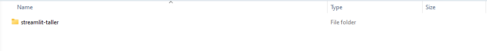

### Paso 0.2: Abrir la carpeta con un editor de código (Se recomienda Visual Studio Code).

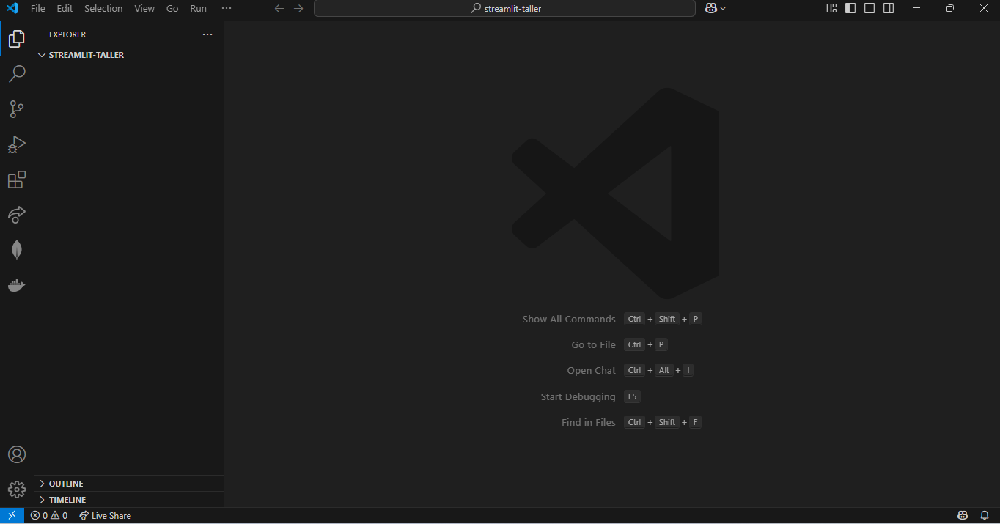

### Paso 0.3: Abrir una consola ubicada en la carpeta del proyecto.

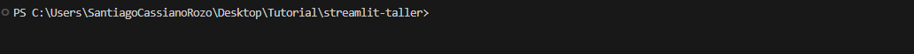

### Paso 0.4: Verificar las versiones de Python instaladas en el computador.

Para listar las versiones de Python se puede ejecutar el siguiente comando en la consola.

```console
py --list
```

En la consola se deberia ver una lista de las versiones de Python instaladas. Por ejemplo, esta seria la respuesta en caso de tener instaladas las versiones 3.11 y 3.12:

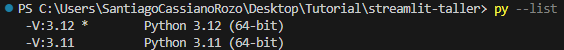

### Paso 0.5: Crear un entorno virtual de Python.

Un entorno virtual de python es una carpeta donde se tiene una versión de Python y paquetes instalados de forma aislada a la instalación principal de Python que se tiene en todo el sistema.

Para crear un entorno virtual que tenga nombre _.venv_ se debe usar el siguiente comando, donde la X se debe remplazar por la versión de Python con la que se quiere crear el entorno virtual

```console
py -3.X -m venv .venv
```

Por ejemplo, en caso de crear un entorno virtual de Python 3.11 (que es la version recomendada) se usaria el comando:

```console
py -3.11 -m venv .venv
```

Tras ejecutar el comando se debio crear una carpeta llamada _.venv_ en el proyecto, esta carpeta corresponde al entorno virtual que se usará para el proyecto:

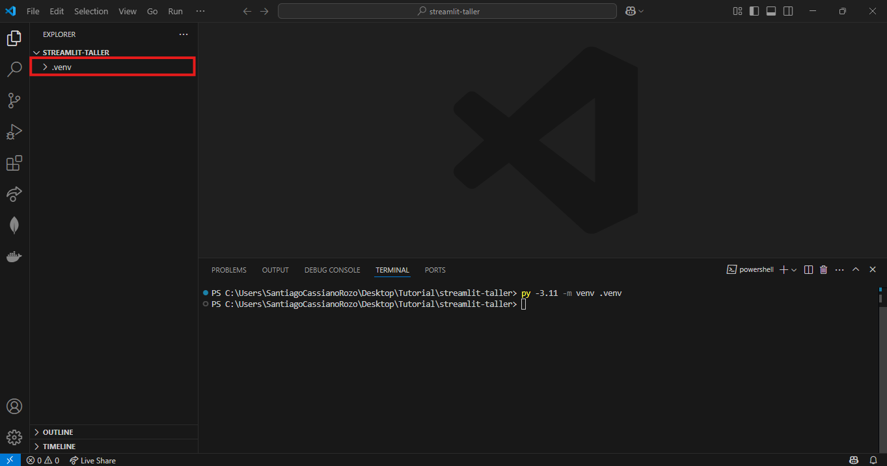

### Paso 0.6: Activar el entorno virtual en la terminal

En la terminal ubicada en la carpeta del proyecto se debe ejecutar alguno de los siguientes comandos para activar el entorno virtual.

En caso de tener una terminal de Powershell utilizar el comando:

```console
.\.venv\Scripts\activate.ps1
```

En caso de tener una terminal de comandos de Windows (CMD) utilziar el comando: 
```console
.\.venv\Scripts\activate.bat
```

Tras ejecutar el comando, en la parte izquierda de la terminal deberia verse el nombre del entorno virtual que fue activado:

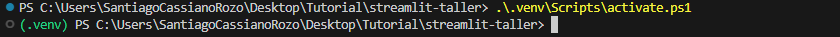

Al tener el entorno virtual activado en la terminal, todos los paquetes que se instalen desde la terminal unicamente serán almacenados en el entorno virtual, no en la instalación de Python de todo el sistema.

### Paso 0.7: Instalar Streamlit en el entorno virtual

Para instalar Streamlit se debe utilizar el siguiente comando en la terminal que tiene el entorno virtual activado:

```console
pip install streamlit==1.44.1
```

Tras ejecutar el comando empezarán a descargarse e instalarse todas las librerias necesarias para Streamlit. Este proceso puede tardar unos minutos.

## Paso 1: Crear un Hola Mundo en Streamlit.

### Paso 1.1: Crear el archivo _hola_mundo.py_

Las aplicaciones de Streamlit se basan en archivos de Python. Es por ello que lo primero que se debe hacer para crear una aplicación de Streamlit es crear un archivo Python. Para este taller se debe crear un archivo llamado _hola_mundo.py_ dentro de la carpeta del proyecto:

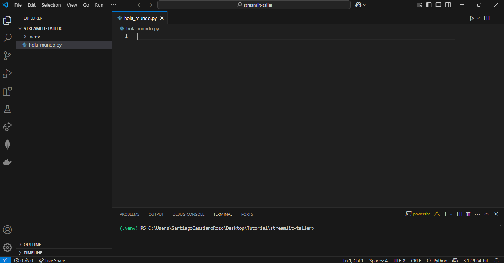

### Paso 1.2: Agregar el mensaje _Hola Mundo_ a la aplicación

Para que la aplicación muestre el mensaje _Hola Mundo_ se deben escribir las siguientes lineas de código en el archivo _hola_mundo.py_

```python
import streamlit as st

st.write("Hola Mundo")
```

La primera linea del código se encarga de importar la libreria streamlit y permite utilizarla bajo el nombre _st_. La segunda linea utiliza el elemento [st.write()](https://link-url-here.org) de Streamlit. Este elemento permite mostrar en la pantalla de la aplicación el texto que recibe como argumento.

Tras escribir este código se debe guardar el archivo _hola_mundo.py_

### Paso 1.3: Ejecutar la aplicación _hola_mundo.py_

Para ejecutar la aplicación se debe utilizar el siguiente comando en la terminal que tiene activado el entorno virtual:

```console
streamlit run hola_mundo.py
```

Al ejecutar el comando debio abrirse una ventana del navegador en la URL http://localhost:8501 

Dentro de esta ventana deberia verse el mensaje 'Hola Mundo':

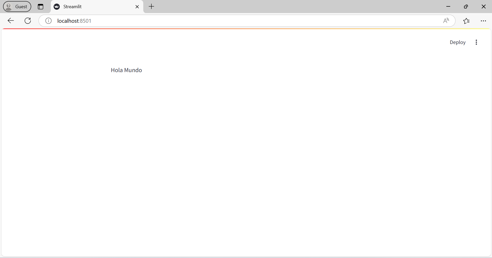

En la parte superior de la pantalla aparece el boton _Deploy_ y un botón de opciones. Estos [botones](https://docs.streamlit.io/develop/concepts/architecture/app-chrome) son creados automaticamente por Streamlit y tienen funcionalidades más avanzadas que no se van a cubrir en este taller.

Con estos pasos se ha creado un Hola Mundo en Streamlit.

## Paso 2: Crear una aplicación para saludar con un boton.

### Paso 2.1: Agregar un boton a la aplicación.

Para agregar un boton a la aplicación se debe usar el elemento [st.button()](https://docs.streamlit.io/develop/api-reference/widgets/st.button). Este elemento permite dibujar un botón en la pantalla y cada vez que dicho boton sea oprimido la función st.button() retornará el valor True.

Para incluir en la aplicación un botón que muestre el mensaje _Hola Mundo_ al ser presionado se debe modificar el código del archivo _hola_mundo.py_ de la siguiente forma:

```python
import streamlit as st

boton_saludar = st.button("Saludar")

if boton_saludar:
    #Esta parte del código se ejecuta cuando se presiona el boton
    st.write("Hola Mundo")
```

En esta modificación se ha incluido un st.button. El primer argumento del st.button es el texto que se quiere mostrar sobre el botón.

El botón creado se ha asignado a la variable _boton_saludar_. La variable _boton_saludar_ tomará el valor True cuando el botón sea presionado por el usuario, y cuando esto pase se ejecutará el código dentro de la sentencia _if_, lo cual hará que se escriba el mensaje _Hola Mundo_ en la pantalla.

Una vez se han guardado estos cambios en el archivo _hola_mundo.py_ se puede ir nuevamente a la dirección http://localhost:8501 en el navegador.

Al entrar se deberia seguir viendo unicamente el mensaje _Hola Mundo_, esto ocurre debido a que el navegador aún no ha vuelto a ejecutar la aplicación con los ultimos los cambios realizados en el archivo _hola_mundo.py_.

Para que el navegador vuelva a ejecutar la aplicación y refleje los ultimos cambios del código se tienen dos opciones:

1. Oprimir la tecla R dentro del navegador.

2. Ubicar el cursor sobre el logo _i_ que aparece en la esquina superior derecha de la pantalla y luego dar click al boton _Rerun_:

https://github.com/user-attachments/assets/3c6c8a82-aa81-4837-b97a-b40cf16dea6d

Tras esto, en el navegador se ven los ultimos cambios realizados en la aplicación y ahora aparece el botón _Saludar_ en la pantalla. Cuando se oprime el boton se muestra el mensaje _Hola Mundo_:

https://github.com/user-attachments/assets/79f6f154-012d-4daa-966b-42e6cb7f01a1

### Paso 2.2: Agregar un campo de texto para escribir un nombre

Ahora vamos a modificar el código de la aplicación para que se pueda recibir el nombre del usuario y se puede escribir un mensaje saludandolo tras oprimir un boton.

Para esto debemos modificar el código dentro del archivo _hola_mundo.py_ para que se vea de la siguiente manera:

```python
import streamlit as st

nombre_usuario = st.text_input("Escribe tu nombre")

boton_saludar = st.button("Saludar")

if boton_saludar:
    #Esta parte del código se ejecuta cuando se presiona el boton
    st.write(f"Hola {nombre_usuario}")
```

En este caso se ha agregado un elemento de tipo [st.text_input()](https://docs.streamlit.io/develop/api-reference/widgets/st.text_input) al inicio de la aplicación. Este elemento dibuja una caja de texto donde el usuario puede escribir. El primer argumento del st.text_input() corresponde al mensaje que se quiere mostrar en pantalla sobre la caja de texto.

La variable _nombre_usuario_ va a almacenar el texto que se escriba en la caja de texto dibujada por el elemento st.text_input. 

Por otra parte, ahora el mensaje que se escribe en pantalla con st.write va a incluir el _nombre_usuario_ que se haya escrito en la caja de texto.

Para visualizar todos estos elementos se deben guardar los cambios del archivo _hola_mundo.py_ y se debe ir al navegador. Tras dar click al boton _Rerun_ se deberia ver la siguiente interfaz:

https://github.com/user-attachments/assets/29ec2a30-f612-4afc-81c9-de6cd1d7dc32

Esta interfaz contiene los elementos que se mencionaron anteriormente y permite mostrar un saludo al usuario al oprimir el boton _Saludar_.

### Paso 2.3: Detener la aplicación

Para detener la aplicación de Streamlit se debe ir a la terminal donde se esta ejecutando la aplicación y oprimir CTRL+C. 

**Es importante que durante este proceso no se cierre la ventana del navegador** donde se estaba viendo la aplicación, ya que si la ventana del navegador se encuentra cerrada, la aplicación no se va a detener con CTRL+C.

Video ejemplo sobre cómo se ve la terminal tras detener la aplicación exitosamente:

https://github.com/user-attachments/assets/a8eb70fa-b605-44ea-8723-e643f17196ef

### Paso 2.4: Conclusión

En esta sección se pudo ver que por medio de los elementos que ofrece Streamlit se pudo crear una aplicación que puede recibir el nombre de un usuario y saludarlo con tan solo 9 lineas de código.

Streamlit acelera mucho el desarrollo de aplicaciones web debido a que permite incluir facilmente elementos en la interfaz simplemente llamando sus funciones dentro del código Python. 

Cabe resaltar que Streamlit tiene una amplia [biblioteca de elementos](https://docs.streamlit.io/develop/api-reference) que se pueden utilizar para mostrar diversos tipos de textos o graficas. Tambien tiene varios elementos para recibir distintos tipos de inputs.

La idea de esta primera parte del taller era familiarizarse con la forma en que se suelen llamar los elementos de Streamlit y cómo estos se ven reflejados en la interfaz grafica.


## Paso 3: Crear un Mini Prompt Lab

En esta sección del taller se busca crear una versión reducida de la sección Freeform del Prompt Lab de WatsonX que se vio en la sesión teorica del jueves.

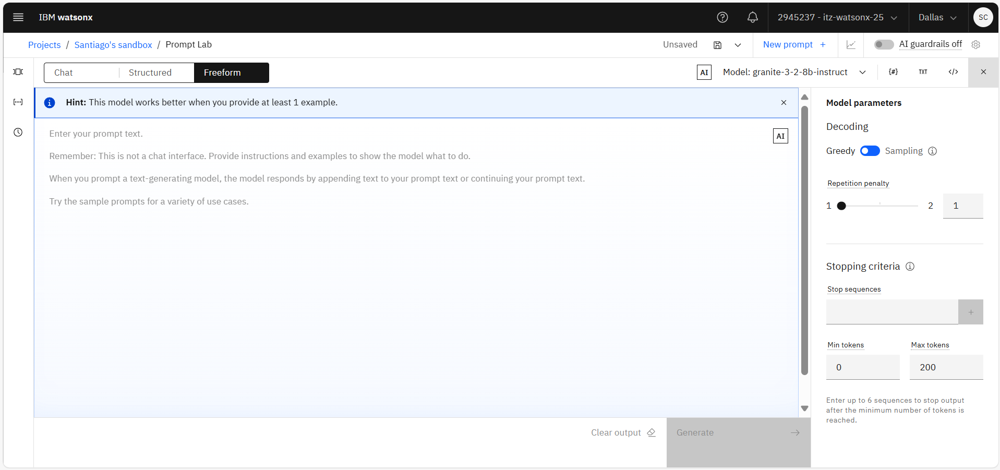

Dentro de esta aplicación se podrá llamar a un modelo generativo alojado en la plataforma WatsonX utilizando los parametros que prefiera el usuario.

### Paso 3.1: Eliminar el archivo _hola_mundo.py_

### Paso 3.2: Crear un nuevo archivo llamado _mini_prompt_lab.py_.

Tras realizar estos cambios, la carpeta del proyecto deberia verse de la siguiente forma.

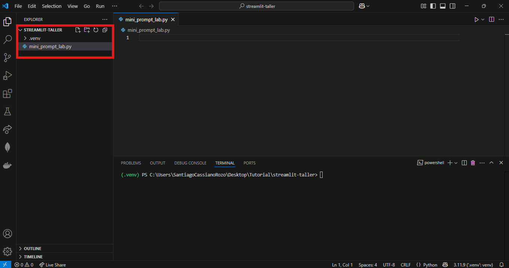

### Paso 3.3: Agregar un titulo a la aplicación.

En Streamlit se puede usar el elemento [st.title()](https://docs.streamlit.io/develop/api-reference/text/st.title) para mostrar un texto con formato de titulo dentro de la aplicación.

Para incluir un titulo en el Mini Prompt Lab se debe escribir el siguiente código en el archivo _mini_prompt_lab.py_

```python
import streamlit as st

st.title("Mini Prompt Lab")
```

Para ejecutar la aplicación se debe ejecutar el siguiente comando en la terminal.

```console
streamlit run mini_prompt_lab.py
```

Tras ejecutar la aplicación en el navegador deberia verse lo siguiente.

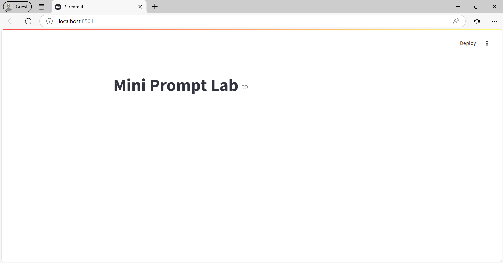

### Paso 3.4: Agregar un menu para elegir el modelo.

Para agrear un menu en el cual se pueda elegir uno de los modelos disponibles en WatsonX se puede utilizar un elemento [st.selectbox()](https://docs.streamlit.io/develop/api-reference/widgets/st.selectbox). Este elemento crea un menu tipo dropdown en el cual se puede elegir entre una lista de opciones.

Para incluir este menu en la aplicación se debe modificar el código en _mini_prompt_lab.py_ de la siguiente manera:

```python
import streamlit as st

st.title("Mini Prompt Lab")

modelo_seleccionado = st.selectbox("Elige el modelo que quieres utilizar", ["ibm/granite-3-2-8b-instruct","mistralai/mistral-large", "meta-llama/llama-3-3-70b-instruct", "meta-llama/llama-4-scout-17b-16e-instruct", "meta-llama/llama-4-maverick-17b-128e-instruct-fp8"])
```

La variable _modelo_seleccionado_ va a almacenar el modelo que elija el usuario desde la interfaz grafica. En este caso en el st.selectbox se incluyen 5 modelos a elegir para el usuario (Granite 3.2 8b, Mistral Large, Llama 3.3 70b, Llama 4 Scout, Llama 4 Maverick).

Si se ingresa nuevamente a la aplicación en el navegador, ahora debe haber un menu donde se puede elegir el modelo:

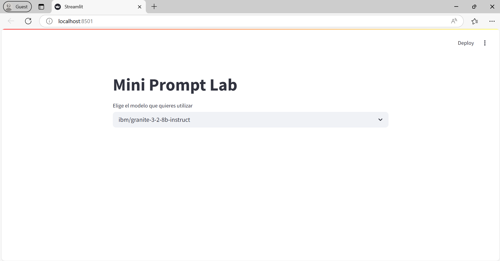

### Paso 3.5: Agregar espacios para indicar la cantidad mínima y máxima de tokens de respuesta.

Streamlit permite al usuario ingresar números por medio del elemento [st.number_input()](https://docs.streamlit.io/develop/api-reference/widgets/st.number_input).

Para que el usuario un st.number_input() para que el usuario pueda indicar la cantidad mínima de tokens y otro para que pueda indicar la cantiadad máxima de tokens que espera de respuesta. 

Para esto se debe modificar el código escrito en _mini_prompt_lab.py_ de la siguiente forma.

```python
import streamlit as st

st.title("Mini Prompt Lab")

modelo_seleccionado = st.selectbox("Elige el modelo que quieres utilizar", ["ibm/granite-3-2-8b-instruct","mistralai/mistral-large", "meta-llama/llama-3-3-70b-instruct", "meta-llama/llama-4-scout-17b-16e-instruct", "meta-llama/llama-4-maverick-17b-128e-instruct-fp8"])

min_tokens_seleccionados = st.number_input("Tokens de respuesta mínimos", min_value=0)

max_tokens_seleccionados = st.number_input("Tokens de respuesta máximos", min_value=0, value=200)
```

Las variables _min_tokens_seleccionados_ y _max_tokens_seleccionados_ almacenarán el número que ingrese el usuario en sus respectivos st.number_input().

Tras estos cambios, la aplicación en el navegador debe verse de la siguiente forma:

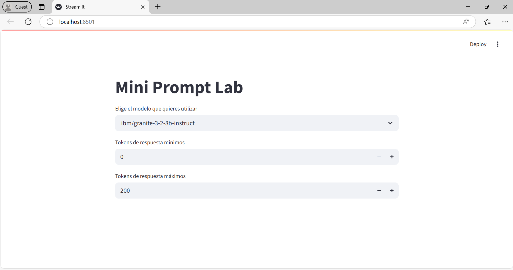

### Paso 3.6: Agregar un menu para seleccionar el modo de decodificación

Para que en la aplicación el usuario peuda seleccionar entre utilizar el modo de decodificación "Greedy" o "Sampling" se puede utilizar un menu del tipo [st.radio()](https://docs.streamlit.io/develop/api-reference/widgets/st.radio). Este menu permite al usuario elegir una entre varias opciones.

El código en el archivo _mini_prompt_lab.py_ se debe modificar de la siguiente manera para incluir un menu que permita seleccionar el modo de decodificación:

```python
import streamlit as st

st.title("Mini Prompt Lab")

modelo_seleccionado = st.selectbox("Elige el modelo que quieres utilizar", ["ibm/granite-3-2-8b-instruct","mistralai/mistral-large", "meta-llama/llama-3-3-70b-instruct", "meta-llama/llama-4-scout-17b-16e-instruct", "meta-llama/llama-4-maverick-17b-128e-instruct-fp8"])

min_tokens_seleccionados = st.number_input("Tokens de respuesta mínimos", min_value=0)

max_tokens_seleccionados = st.number_input("Tokens de respuesta máximos", min_value=0, value=200)

modo_seleccionado = st.radio("Elige un modo de decodificación", ["Greedy", "Sampling"])
```

Tras este cambio, la aplicación en el navegador debe verse de la siguiente forma:

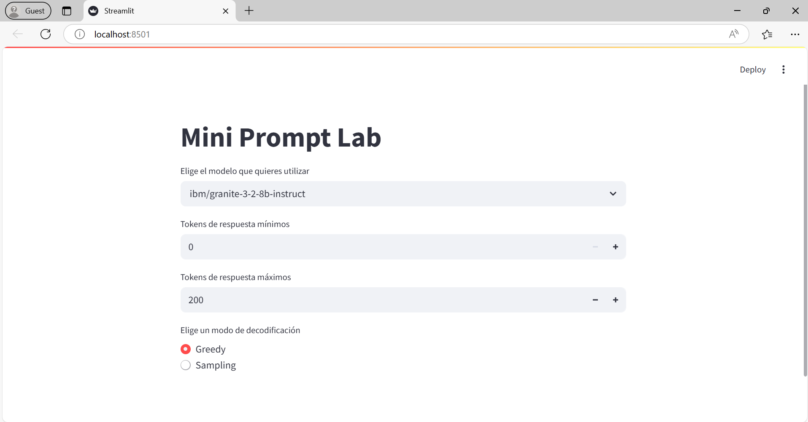

### Paso 3.7: Agregar los parametros para el modo Sampling.

Cuando se selecciona el modo Sampling en el Prompt Lab se permite al usuario configurar parametros adicionales cómo lo son la temperatura, el top p, el top k y la random seed para la generación del texto:

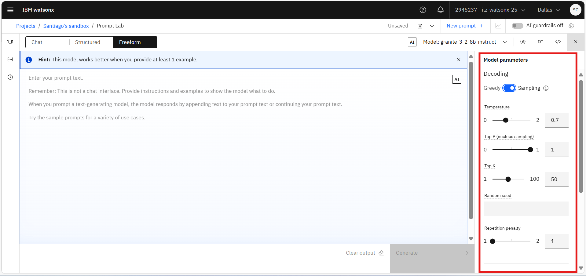

En la aplicación se van a agregar elementos del tipo [st.slider()](https://docs.streamlit.io/develop/api-reference/widgets/st.slider) para que el usuario pueda seleccionar la temperatura, top p  y top k cuando tenga seleccionado el modo "Sampling". Además se va a agregar un st.number_input() para que indique la random seed a utilizar.

Para incluir esta lógica en la aplicación, se debe modificar el archivo _mini_prompt_lab.py_ para que quede de la siguiente forma:

```python
import streamlit as st

st.title("Mini Prompt Lab")

modelo_seleccionado = st.selectbox("Elige el modelo que quieres utilizar", ["ibm/granite-3-2-8b-instruct","mistralai/mistral-large", "meta-llama/llama-3-3-70b-instruct", "meta-llama/llama-4-scout-17b-16e-instruct", "meta-llama/llama-4-maverick-17b-128e-instruct-fp8"])

min_tokens_seleccionados = st.number_input("Tokens de respuesta mínimos", min_value=0)

max_tokens_seleccionados = st.number_input("Tokens de respuesta máximos", min_value=0, value=200)

modo_seleccionado = st.radio("Elige un modo de decodificación", ["Greedy", "Sampling"])

if modo_seleccionado == "Sampling":
    temperature_seleccionada = st.slider("Temperature", min_value=0.00, max_value=2.00, value=0.7, step=0.01)
    top_p_seleccionado = st.slider("Top P", min_value=0.01, max_value=1.00, value=1.00, step=0.01)
    top_n_seleccionado = st.slider("Top K", min_value=1, max_value=100, value=50, step=1)
    random_seed_seleccionada = st.number_input("Random seed", min_value=1)
```

Los elementos de tipo st.slider() retornan el valor que el usuario haya seleccionado desde la interfaz.

Tras guardar los cambios realizados, en el navegador al seleccionar la opción "Sampling" deberian salir los siguientes elementos:

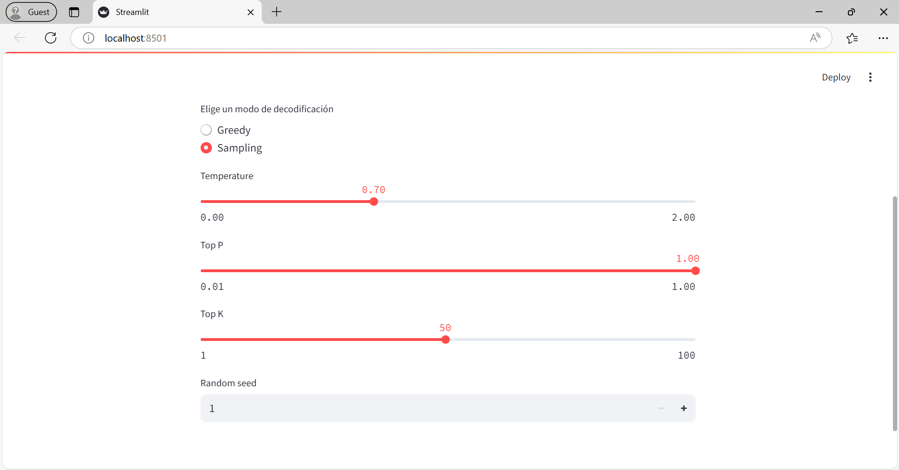

### Paso 3.8: Agregar un slider para el parametro Repetition Penalty

Al final del código se va a agregar otro st.slider() con el cual se pueda seleccionar el valor de repetition penalty tanto cuando se selecciona el modo "Greedy" cómo cuando se selecciona el modo "Sampling".

Para ello se debe modificar el código de _mini_prompt_lab.py_ de la siguiente forma:

```python
import streamlit as st

st.title("Mini Prompt Lab")

modelo_seleccionado = st.selectbox("Elige el modelo que quieres utilizar", ["ibm/granite-3-2-8b-instruct","mistralai/mistral-large", "meta-llama/llama-3-3-70b-instruct", "meta-llama/llama-4-scout-17b-16e-instruct", "meta-llama/llama-4-maverick-17b-128e-instruct-fp8"])

min_tokens_seleccionados = st.number_input("Tokens de respuesta mínimos", min_value=0)

max_tokens_seleccionados = st.number_input("Tokens de respuesta máximos", min_value=0, value=200)

modo_seleccionado = st.radio("Elige un modo de decodificación", ["Greedy", "Sampling"])

if modo_seleccionado == "Sampling":
    temperature_seleccionada = st.slider("Temperature", min_value=0.00, max_value=2.00, value=0.7, step=0.01)
    top_p_seleccionado = st.slider("Top P", min_value=0.01, max_value=1.00, value=1.00, step=0.01)
    top_n_seleccionado = st.slider("Top K", min_value=1, max_value=100, value=50, step=1)
    random_seed_seleccionada = st.number_input("Random seed", min_value=1)

repetition_penalty_seleccionada = st.slider("Repetition Penalty", min_value=1.00, max_value=2.00, value=1.00, step=0.01)
```

Tras agregar este elemento, en la parte de abajo de la aplicación deberia salir un slider para seleccionar el valor de repetition penalty:

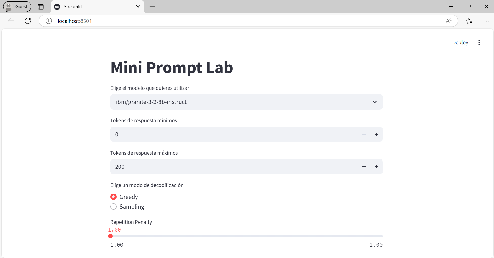

### Paso 3.9: Agregar un espacio para el prompt y un boton para llamar al modelo.

Para agregar un espacio donde el usuario pueda escribir el prompt se va a utilizar un elemento del tipo [st.text_area()](https://docs.streamlit.io/develop/api-reference/widgets/st.text_area). Además, se va a agregar al final un botón con el cual llamar al modelo con el prompt y los parametros seleccionados.

Para esto se debe modificar el código del archivo _mini_prompt_lab.py_ para que quede de la siguiente forma:

```python
import streamlit as st

st.title("Mini Prompt Lab")

modelo_seleccionado = st.selectbox("Elige el modelo que quieres utilizar", ["ibm/granite-3-2-8b-instruct","mistralai/mistral-large", "meta-llama/llama-3-3-70b-instruct", "meta-llama/llama-4-scout-17b-16e-instruct", "meta-llama/llama-4-maverick-17b-128e-instruct-fp8"])

min_tokens_seleccionados = st.number_input("Tokens de respuesta mínimos", min_value=0)

max_tokens_seleccionados = st.number_input("Tokens de respuesta máximos", min_value=0, value=200)

modo_seleccionado = st.radio("Elige un modo de decodificación", ["Greedy", "Sampling"])

if modo_seleccionado == "Sampling":
    temperature_seleccionada = st.slider("Temperature", min_value=0.00, max_value=2.00, value=0.7, step=0.01)
    top_p_seleccionado = st.slider("Top P", min_value=0.01, max_value=1.00, value=1.00, step=0.01)
    top_n_seleccionado = st.slider("Top K", min_value=1, max_value=100, value=50, step=1)
    random_seed_seleccionada = st.number_input("Random seed", min_value=1)

repetition_penalty_seleccionada = st.slider("Repetition Penalty", min_value=1.00, max_value=2.00, value=1.00, step=0.01)

prompt_del_usuario = st.text_area("Prompt", placeholder="Escribe aquí tu prompt")

boton_llamar_modelo = st.button("Llamar al modelo")
```

La variable _prompt_del_usuario_ va a almacenar el texto que el usuario escriba en el area de texto que se muestra en la aplicación.

Tras estos cambios, en la parte de abajo de la aplicación deberian verse los siguientes elementos:

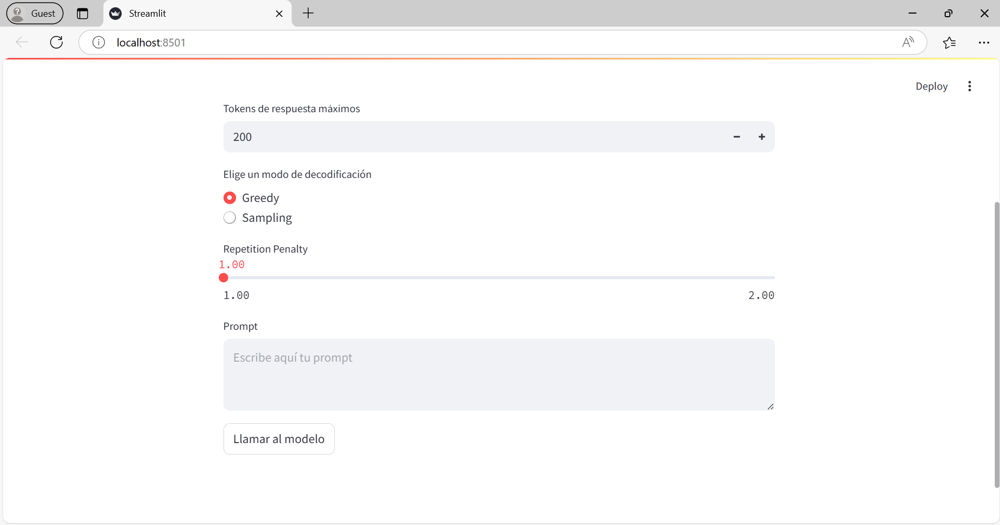

Hasta el momento se ha adelantado la mayor parte de la interfaz del Mini Prompt Lab. A continuación se va a escribir el código que va permitir llamar los modelos alojados en WatsonX.

### Paso 3.10: Instalar las librerias necesarias para llamar a WatsonX

Para instalar las librerias primero se debe detener la aplicación de Streamlit utilizando CTRL+C en la terminal.

Tras esto, en la misma terminal se debe ejecutar el comando:

```console
pip install ibm-watsonx-ai==1.3.3
```

Luego se debe ejecutar este otro comando:

```console
pip install ibm-cloud-sdk-core==3.23.0
```

Las librerias [ibm-watsonx-ai](https://ibm.github.io/watsonx-ai-python-sdk/) y [ibm-cloud-sdk-core](https://pypi.org/project/ibm-cloud-sdk-core/) permiten conectarse a diversos servicios ofrecidos por WatsonX facilmente.

### Paso 3.11: Instalar una liberia para leer variables de entorno

Normalmente las credenciales para acceder a los modelos de IA Generativa se escriben en un archivo _.env_ y luego se leen desde la aplicación. Esto para evitar que las credenciales queden quemadas directamente en el código y puedan ser copiadas por otras personas.

Para poder leer variables almacenadas en un archivo _.env_ se debe instalar la libreria [python-dotenv](https://pypi.org/project/python-dotenv/) con el comando:

```console
pip install python-dotenv==1.1.0
```

### Paso 3.12: Crear el archivo _.env_ para escribir las credenciales

En la carpeta del proyecto se crea un archivo llamado _.env_

Se recomienda crear este archivo desde Visual Studio Code para evitar que quede con extensiones adicionales en el nombre, ya que es importante que unicamente se llame _.env_:

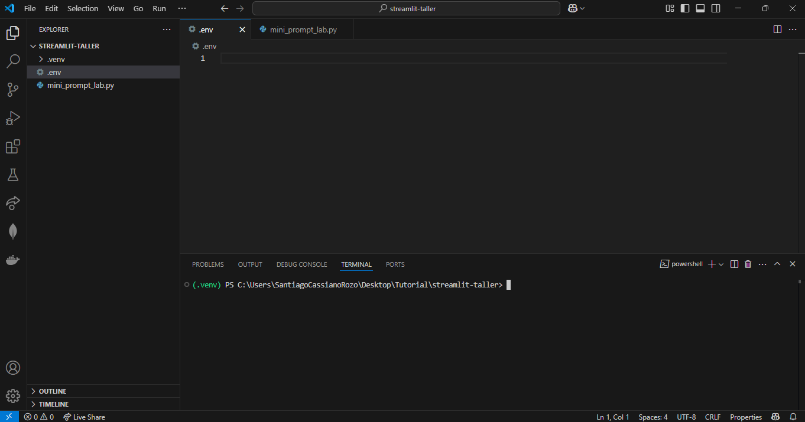

Dentro del archivo _.env_ se escribir las siguientes variables:

```bat
WATSONX_API_KEY = 
IBM_CLOUD_URL = https://us-south.ml.cloud.ibm.com
WATSONX_PROJECT_ID = 
```

A las variables WATSONX_API_KEY y WATSONX_PROJECT_ID se les debe asignar el Api Key y Project Id que le den los tutores el dia del taller.

Una vez asignados esos valores, el archivo _.env_ deberia verse de forma similar al siguiente:

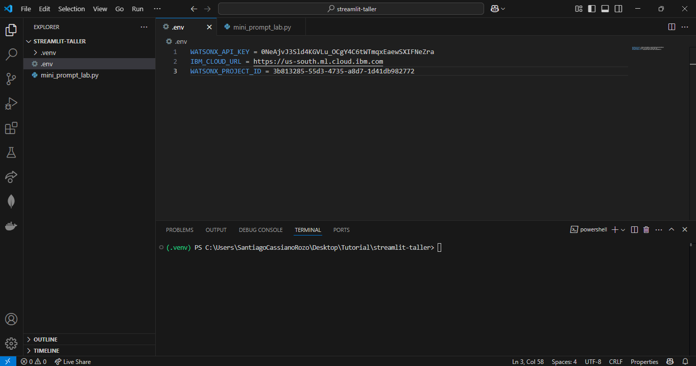

Tras esto se puede guardar y cerrar el archivo _.env_.

### Paso 3.13: Crear un archivo con las funciones necesarias para llamar a WatsonX

Dentro de la carpeta del proyecto se debe crear una carpeta llamada _utils_ y dentro de esta carpeta se debe crear un archivo llamado _watsonx_functions.py_. En el editor deberia verse de la siguiente manera:

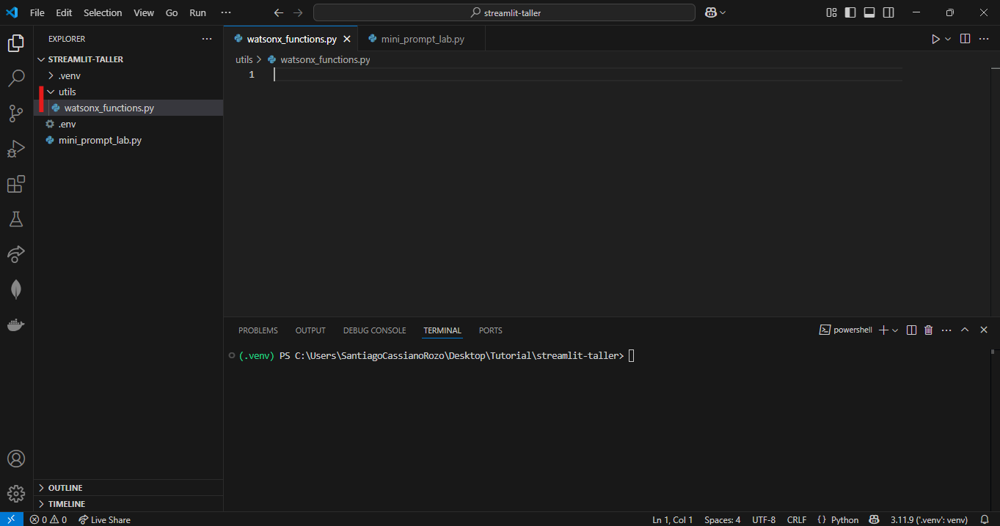

Dentro de este archivo se debe copiar el siguiente código, el cual trae dos funciones hechas para llamar los modelos en WatsonX:

```python
from ibm_watsonx_ai.foundation_models import ModelInference
from ibm_watsonx_ai.metanames import GenTextParamsMetaNames as GenParams
from dotenv import load_dotenv
import os
from ibm_cloud_sdk_core.authenticators import IAMAuthenticator
import requests
import base64

#Cargar las variables de entorno escritas en el archivo .env
load_dotenv()

#Se asginan las variables de entorno a variables en el script
watsonx_api_key = os.environ["WATSONX_API_KEY"]
ibm_cloud_url = os.environ["IBM_CLOUD_URL"]
watsonx_project_id = os.environ["WATSONX_PROJECT_ID"]

#Se crea el diccionario creds, el cual es utilizado en el llamado a WatsonX
creds = {"url": ibm_cloud_url, "apikey": watsonx_api_key}

#Funcion para llamar modelos de texto alojados en WatsonX
def call_watsonx_text_model(
    prompt: str,
    id_modelo: str,
    min_tokens: int,
    max_tokens: int,
    modo: str,
    repetition_penalty: float,
    temperatura: float = 0.7,
    top_p: float = 1.00,
    top_n: int = 50,
    random_seed: int = 1):

    if modo == "Greedy":
        #Si el modo es greedy, le pasamos los siguientes parametros al modelo
        parametros = {
            GenParams.DECODING_METHOD: "greedy",
            GenParams.MIN_NEW_TOKENS: min_tokens,
            GenParams.MAX_NEW_TOKENS: max_tokens,
            GenParams.REPETITION_PENALTY: repetition_penalty,
        }

    elif modo == "Sampling":
        #Si el modo es sampling, le pasamos los siguientes parametros al modelo
        parametros = {
            GenParams.DECODING_METHOD: "sample",
            GenParams.MIN_NEW_TOKENS: min_tokens,
            GenParams.MAX_NEW_TOKENS: max_tokens,
            GenParams.TEMPERATURE: temperatura,
            GenParams.TOP_P: top_p,
            GenParams.TOP_K: top_n,
            GenParams.RANDOM_SEED: random_seed,
            GenParams.REPETITION_PENALTY: repetition_penalty
        }

    #Se crea un objeto ModelInference con todos los datos proporcionados
    watsonx_model = ModelInference(model_id=id_modelo, params=parametros, credentials=creds, project_id=watsonx_project_id)

    #Utilizando el metodo generate_text del objeto ModelInference se hace un 
    #llamado al modelo con el prompt que se pasa como argumento. El modelo se encuentra alojado en IBM Cloud.
    #La función retorna el texto generado por el modelo.
    watsonx_response = watsonx_model.generate_text(prompt)
    return watsonx_response

#Funcion para llamar modelos multimodales de vision alojados en WatsonX
def call_watsonx_vision_model(
    prompt: str,
    imagen,
    id_modelo: str,
    max_tokens: int):

    #Leer los bytes de la imagen
    image_bytes = imagen.getvalue()

    #Codificar la imagen en base 64
    image_base64_encoded_bytes = base64.b64encode(image_bytes)

    #Decodificar de base 64 a un string con codificacion utf8
    image_utf8_string = image_base64_encoded_bytes.decode('utf-8')

    #Crear un autenticador para llamar a WatsonX
    authenticator = IAMAuthenticator(watsonx_api_key)

    #Generar un bearer token
    bearer_token = authenticator.token_manager.get_token()

    #Definir la url a la que se va a hacer la consulta:
    url = "https://us-south.ml.cloud.ibm.com/ml/v1/text/chat?version=2023-05-29"

    #Definir el body de la peticion, en esta se incluye el prompt que vamos a hacer y la imagen en los mensajes
    body = {
	"messages": [
        {"role":"user",
         "content":[
            {"type":"text",
              "text":prompt
            },
            {"type":"image_url",
             "image_url":{"url":f"data:{imagen.type};base64,{image_utf8_string}"}
            }
        ]}
    ],
	"project_id": watsonx_project_id,
	"model_id": id_modelo,
	"max_tokens": max_tokens,
    "temperature": 0,
    "top_p": 1,
    "frecuency_penalty":0,
    "presence_penalty":0
    }

    #Headers de la peticion
    headers = {
        "Accept": "application/json",
        "Content-Type": "application/json",
        "Authorization": "Bearer "+ bearer_token
    }

    #Se realiza la peticion al modelo
    response = requests.post(url, headers=headers, json=body)

    #Si la respuesta no es exitosa generar un error
    if response.status_code != 200:
        raise Exception("Non-200 response: "+ str(response.text))
    
    #Si la respuesta fue exitosa entonces leer el json de la respuesta y retornar el texto generado por el modelo
    response_json = response.json()
    return response_json['choices'][0]['message']['content']
```

En el código hay dos funciones:
- La funcion _call_watsonx_text_model()_ permite llamar a los modelos capaces de procesar texto. Esta función recibe el prompt que se quiere realizar y todos los parametros con los que se quiere llamar el modelo alojado en la plataforma WatsonX. Dependiendo de si seleccionamos el modo “Greedy”, o “Sampling”, se envian algunos parametros o no. La función retorna unicamente el texto generado por el modelo.

- La funcion _call_watsonx_vision_model()_ permite llamar a los modelos multimodales capaces de recibir imagenes y texto para generar una respuesta. Esta función recibe el prompt que se quiere realizar, la imagen que se quiere adjuntar y algunos parametros con los que llamar el modelo alojado en la plataforma WatsonX. La función retorna unicamente el texto generado por el modelo.

Una vez se ha escrito el código en el archivo _watsonx_functions.py_ se puede cerrar y guardar el archivo.

### Paso 3.14: Importar la funcion _call_watsonx_text_model_ dentro del archivo _mini_prompt_lab.py_

Para importar la función se debe incluir esta sentencia al inicio del código:

```python
from utils.watsonx_functions import call_watsonx_text_model
```

### Paso 3.15: Incluir la lógica para llamar a un modelo en _mini_prompt_lab.py_

Al final del archivo _mini_prompt_lab.py_ se debe incluir la lógica para que cuando se oprima el botón "Llamar al modelo", se llamé la función _call_watsonx_text_model()_ con los parametros que ha ido definiendo el usuario en la aplicación.

Para esto se debe modificar el código del archivo _mini_prompt_lab.py_ para que quede de la siguiente manera:

```python
import streamlit as st
from utils.watsonx_functions import call_watsonx_text_model

st.title("Mini Prompt Lab")

modelo_seleccionado = st.selectbox("Elige el modelo que quieres utilizar", ["ibm/granite-3-2-8b-instruct","mistralai/mistral-large", "meta-llama/llama-3-3-70b-instruct", "meta-llama/llama-4-scout-17b-16e-instruct", "meta-llama/llama-4-maverick-17b-128e-instruct-fp8"])

min_tokens_seleccionados = st.number_input("Tokens de respuesta mínimos", min_value=0)

max_tokens_seleccionados = st.number_input("Tokens de respuesta máximos", min_value=0, value=200)

modo_seleccionado = st.radio("Elige un modo de decodificación", ["Greedy", "Sampling"])

if modo_seleccionado == "Sampling":
    temperature_seleccionada = st.slider("Temperature", min_value=0.00, max_value=2.00, value=0.7, step=0.01)
    top_p_seleccionado = st.slider("Top P", min_value=0.01, max_value=1.00, value=1.00, step=0.01)
    top_n_seleccionado = st.slider("Top K", min_value=1, max_value=100, value=50, step=1)
    random_seed_seleccionada = st.number_input("Random seed", min_value=1)

repetition_penalty_seleccionada = st.slider("Repetition Penalty", min_value=1.00, max_value=2.00, value=1.00, step=0.01)

prompt_del_usuario = st.text_area("Prompt", placeholder="Escribe aquí tu prompt")

boton_llamar_modelo = st.button("Llamar al modelo")

if boton_llamar_modelo:
    if modo_seleccionado == "Greedy":
        respuesta_generada = call_watsonx_text_model(
            prompt=prompt_del_usuario,
            id_modelo=modelo_seleccionado,
            min_tokens= min_tokens_seleccionados,
            max_tokens = max_tokens_seleccionados,
            modo = modo_seleccionado,
            repetition_penalty=repetition_penalty_seleccionada
        )

    elif modo_seleccionado == "Sampling":
        respuesta_generada = call_watsonx_text_model(
            prompt=prompt_del_usuario,
            id_modelo=modelo_seleccionado,
            min_tokens= min_tokens_seleccionados,
            max_tokens = max_tokens_seleccionados,
            modo = modo_seleccionado,
            repetition_penalty=repetition_penalty_seleccionada,
            temperatura=temperature_seleccionada,
            top_p=top_p_seleccionado,
            top_n=top_n_seleccionado
        )
    
    with st.expander("Respuesta Generada ", expanded=True):
        st.write(respuesta_generada)
```

La lógica adicional agregada al final del código permite que cuando se oprima el boton, se verifique si el usuario seleccionó el modo Greedy o Sampling y a partir de ello se llama a la función _call_watsonx_text_model()_ con los paremetros necesarios para cada modo. 

Una vez se genera la respuesta, esta se muestra dentro de un contenedor de tipo [st.expander()](https://docs.streamlit.io/develop/api-reference/layout/st.expander). Los contenedores en Streamlit permiten crear un espacio en donde se puden incluir otros elementos.

En este caso por medio de las instrucciones 

```python
    with st.expander("Respuesta Generada ", expanded=True):
        st.write(respuesta_generada)
```

Se esta creando un contenedor de tipo st.expander, y dentro de este contenedor se esta escribiendo la respuesta generada. Las instrucciones que se ejecutan dentro de la sentencia _with_ se van a dibujar dentro del contenedor.

Para tener una mayor claridad, se va a ejecutar la aplicación y se vera su funcionamiento.

### Paso 3.16: Ejecutar el Mini Prompt Lab

Para ejecutar la aplicación se ejecuta el comando:

```console
streamlit run mini_prompt_lab.py
```

Una vez se ejecuta, desde el navegador se puede utilizar la aplicación para realizar un prompt a un LLM:

https://github.com/user-attachments/assets/efe11826-e66c-48f5-8bbf-3fd670cb6179

Aquí se puede observar con mayor claridad que cuando el modelo responde se dibuja un contenedor st.expander() y dentro de ese contenedor se escribe la respuesta generada.

### Paso 3.17: Conclusion

Con esto ya se ha creado un Mini Prompt Lab con el cual se pueden experimentar con varios modelos del lenguaje y sus parametros. Dentro de est aplicación se pudo utilizar más elementos de Streamlit y se realizo la conexión con WatsonX.

En la siguiente parte del taller se va a construir un Mini Prompt Lab pero que ahora utilice modelos multimodales para imagenes y texto.

## Paso 4: Crear un Mini Prompt Lab para Modelos Multimodales

En esta parte del taller se va a crear una nueva aplicación que permite realizar preguntas a un modelo multimodal teniendo en cuenta una imagen que el usuario suba o tome con su cámara.

### Paso 4.1: Detener la aplicación _mini_prompt_lab.py_ en caso de que se este ejecutando

### Paso 4.2: Crear un nuevo archivo llamado _multimodal_prompt_lab.py_

La carpeta del proyecto en este momento debe verse de la siguiente forma:

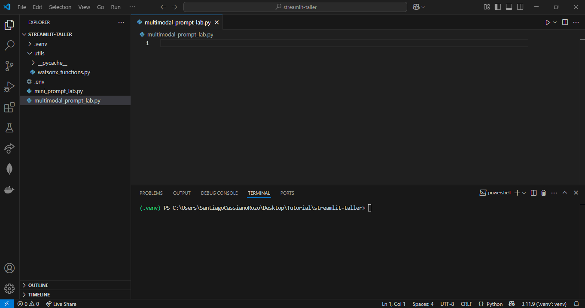

### Paso 4.3: Primera parte de la interfaz de la aplicación.

Dentro del archivo multimodal_prompt_lab.py se deben escribir las siguientes lineas de código:

```python
import streamlit as st 
from utils.watsonx_functions import call_watsonx_vision_model

st.title("Mini Prompt Lab Multimodal")

modelo_seleccionado = st.selectbox("Elige el modelo que quieres utilizar", ["meta-llama/llama-4-scout-17b-16e-instruct", "meta-llama/llama-4-maverick-17b-128e-instruct-fp8", "meta-llama/llama-3-2-90b-vision-instruct","meta-llama/llama-3-2-11b-vision-instruct", "ibm/granite-vision-3-2-2b"]) 

max_tokens_seleccionados = st.number_input("Tokens de respuesta máximos", min_value=0, value=900)

modo_subir_imagen = st.radio("Selecciona una opcion", ["Subir imagen desde mi dispositivo", "Tomar una foto con la cámara"])
```

Estas lineas son similares a las usadas al inicio del Mini Prompt Lab. A partir de estas lineas se crea un titulo para la aplicación, un menu para seleccionar el modelo multimodal que se quiere usar y un espacio para escribir la maxima cantidad de tokens.

Algo nuevo que se agrega en este caso es que se crea un menu en donde el usuario puede decidir si quiere subir una imagen o tomar una foto con su cámara para usarla en la aplicación.

En este momento se puede ejecutar la aplicación con el comando:

```python
streamlit run multimodal_prompt_lab.py
```

Tras ejecutar la aplicación, en el navegador deberian verse los siguientes elementos:

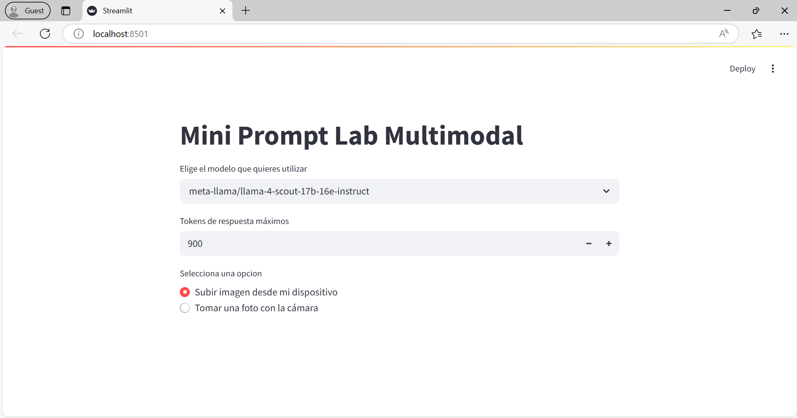

### Paso 4.4: Agregar la lógica para cuando el usuario quiere Subir una Imagen.

Para que el usuario pueda subir una imagen podemos utilizar el elemento [st.file_uploader()](https://docs.streamlit.io/develop/api-reference/widgets/st.file_uploader). Este elemento crea una caja donde el usuario puede subir archivos. Por otra parte, una vez el usuario ha subido una imagen, podemos mostrarla en pantalla utilizando el elemento [st.image()](https://docs.streamlit.io/develop/api-reference/media/st.image).


Para agregar que el usuario pueda subir una imagen y luego podamos ver la imagen subida dentro de un contendor st.expandeer() se debe modificar el código del archivo _multimodal_prompt_lab.py_ de la siguiente manera:

```python
import streamlit as st 
from utils.watsonx_functions import call_watsonx_vision_model

st.title("Mini Prompt Lab Multimodal")

modelo_seleccionado = st.selectbox("Elige el modelo que quieres utilizar", ["meta-llama/llama-4-scout-17b-16e-instruct", "meta-llama/llama-4-maverick-17b-128e-instruct-fp8", "meta-llama/llama-3-2-90b-vision-instruct","meta-llama/llama-3-2-11b-vision-instruct", "ibm/granite-vision-3-2-2b"]) 

max_tokens_seleccionados = st.number_input("Tokens de respuesta máximos", min_value=0, value=900)

modo_subir_imagen = st.radio("Selecciona una opcion", ["Subir imagen desde mi dispositivo", "Tomar una foto con la cámara"])

if modo_subir_imagen == "Subir imagen desde mi dispositivo":
    imagen_subida = st.file_uploader("Sube una imagen", type=["jpg","jpeg","png"])
    if imagen_subida is not None:
        with st.expander("Visualización de la imagen subida", expanded=True):
            st.image(imagen_subida)
```

Si se guardan los cambios y se va al navegador, en la parte de abajo de la pantalla el usuario tiene un espacio donde puede subir la imagen y cuando sube la imagen esta puede verse en la aplicación:

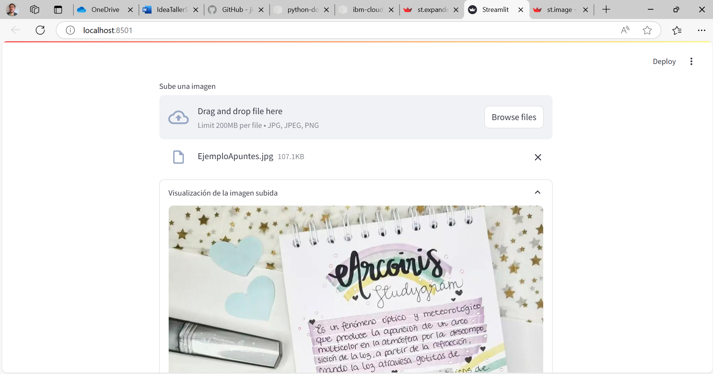

### Paso 4.5 Agregar la lógica para cuando el usuario queire Tomar una foto con su cámara.

Si el usuario quiere que tomar la imagen con su cámara entonces se puede utilizar el elemento [st.camera_input()](https://docs.streamlit.io/develop/api-reference/widgets/st.camera_input). Este elemento cual permite capturar imagenes con la cámara del dispositivo. 

Para que este elemento se muestre cuando el usuario quiere tomar una foto con su dispositivo se debe modificar el código del archiv _multimodal_prompt_lab.py_ de la siguiente forma:

```python
import streamlit as st 
from utils.watsonx_functions import call_watsonx_vision_model

st.title("Mini Prompt Lab Multimodal")

modelo_seleccionado = st.selectbox("Elige el modelo que quieres utilizar", ["meta-llama/llama-4-scout-17b-16e-instruct", "meta-llama/llama-4-maverick-17b-128e-instruct-fp8", "meta-llama/llama-3-2-90b-vision-instruct","meta-llama/llama-3-2-11b-vision-instruct", "ibm/granite-vision-3-2-2b"]) 

max_tokens_seleccionados = st.number_input("Tokens de respuesta máximos", min_value=0, value=900)

modo_subir_imagen = st.radio("Selecciona una opcion", ["Subir imagen desde mi dispositivo", "Tomar una foto con la cámara"])

if modo_subir_imagen == "Subir imagen desde mi dispositivo":
    imagen_subida = st.file_uploader("Sube una imagen", type=["jpg","jpeg","png"])
    if imagen_subida is not None:
        with st.expander("Visualización de la imagen subida", expanded=True):
            st.image(imagen_subida)

elif modo_subir_imagen == "Tomar una foto con la cámara":
    imagen_subida = st.camera_input("Toma una foto")
```

La variable imagen_subida contiene la imagen que subael usuario o que tome con su cámara.

Si se guardan los cambios y se va al navegador, cuando el usuario elija la opción "Tomar una foto con la cámara" debe aparecer un elemento que le permita tomarla:

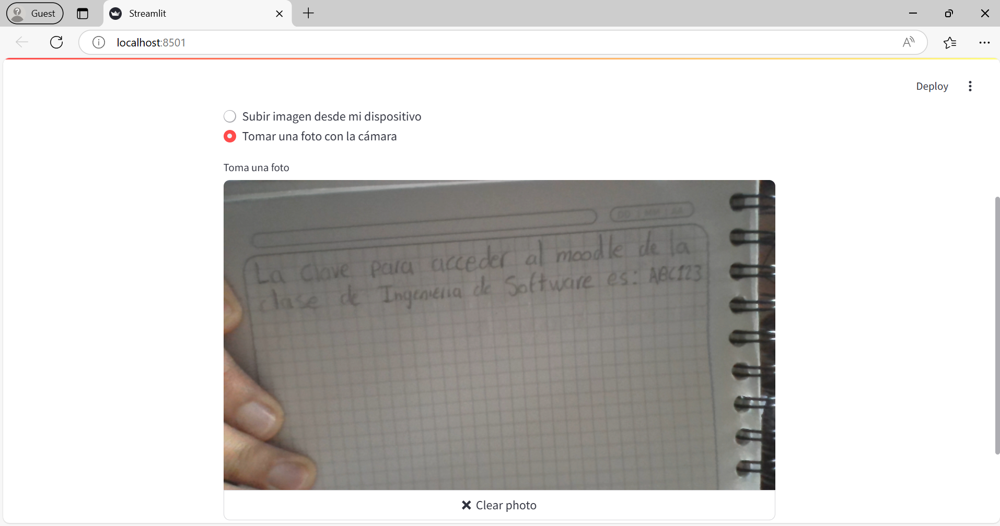

### Paso 4.6: Agregar un espacio para el prompt y un boton para llamar al modelo

Para agregar estos elementos se debe mdoificar el código de _multimodal_prompt_lab.py_ de la siguiente manera:

```python
import streamlit as st 
from utils.watsonx_functions import call_watsonx_vision_model

st.title("Mini Prompt Lab Multimodal")

modelo_seleccionado = st.selectbox("Elige el modelo que quieres utilizar", ["meta-llama/llama-4-scout-17b-16e-instruct", "meta-llama/llama-4-maverick-17b-128e-instruct-fp8", "meta-llama/llama-3-2-90b-vision-instruct","meta-llama/llama-3-2-11b-vision-instruct", "ibm/granite-vision-3-2-2b"]) 

max_tokens_seleccionados = st.number_input("Tokens de respuesta máximos", min_value=0, value=900)

modo_subir_imagen = st.radio("Selecciona una opcion", ["Subir imagen desde mi dispositivo", "Tomar una foto con la cámara"])

if modo_subir_imagen == "Subir imagen desde mi dispositivo":
    imagen_subida = st.file_uploader("Sube una imagen", type=["jpg","jpeg","png"])
    if imagen_subida is not None:
        with st.expander("Visualización de la imagen subida", expanded=True):
            st.image(imagen_subida)

elif modo_subir_imagen == "Tomar una foto con la cámara":
    imagen_subida = st.camera_input("Toma una foto")

if imagen_subida is not None:
    prompt_del_usuario = st.text_area("Prompt", placeholder="Escribe aquí tu prompt")
    boton_llamar_watsonx = st.button("Llamar al modelo multimodal")
    if boton_llamar_watsonx:
        respuesta_generada = call_watsonx_vision_model(
            prompt=prompt_del_usuario,
            imagen=imagen_subida,
            id_modelo=modelo_seleccionado,
            max_tokens=max_tokens_seleccionados
        )

        with st.expander("Respuesta Generada", expanded=True):
            st.write(respuesta_generada)
```

Las lineas incluidas al final se encargan de:

1. Verificar que exista una imagen
2. Cuando hay una imagen subida, mostrar un st.text_area() donde el usuario puede escribir su prompt y mostrar un st.button() para llamar el modelo.
3. Cuando el boton se oprime, se llama a la función _call_watsonx_vision_model_ con los parametros dados por el usuario. Esta función retorna el texto generado por el modelo
4. Finalmente, muestra la respuesta generada dentro de un contendor st.expander().

Una vez se guardan estos cambios y se va al navegador se puede probar la aplicación completa:

https://github.com/user-attachments/assets/9320319f-161e-4448-89e6-1d0242a1251a

### Paso 4.7: Conclusion

Se ha construido una aplicación que permite llamar modelos multimodales alojados en WatsonX.

## Paso 5: Crear una aplicación para interactuar con una base de datos vectorial ChromaDB

[ChromaDB](https://www.trychroma.com/) es una base de datos vectorial con la que se puede interactuar facilmente dentro de Python. La idea en esta sección es crear una aplicación que permita subir, visualizar o eliminar documentos de la base de datos vectorial. 

La aplicación tambien tendrá una sección se podrá hacer una consulta a la base de datos para verificar cuales son los documentos guardados más cercanos a el texto ingresado en la consulta.

### Paso 5.1: Detener la aplicación _multimodal_prompt_lab.py_ en caso de que se este ejecutando

### Paso 5.2: Instalar las dependencias necesarias para utilizar la base de datos vectorial ChromaDB.

Para utilizar ChromaDB en la aplicación se requiere instalar 3 librerias, las cuales se pueden instalar ejecutando siguiente comando en una terminal que tenga el entorno virtual activado:

```console
pip install chromadb==1.0.0 sentence-transformers==4.0.2 transformers==4.50.3
```

**ADVERTENCIA**: Estas librerias tienen un gran tamaño y pueden tardar varios minutos en instalarse. Mientras estas librerias se instalan se puede continuar con los siguientes pasos de este tutorial. 

La libreria _chromadb_ trae todo lo necesario para poder crear e interactuar con una base de datos vectorial de ChromaDB.

Las librerias _sentence-transformers_ y _transformers_ permiten utilizar los modelos de embedding necesarios para crear los vectores  que se van a almacenar en la base de datos.

### Paso 5.2: Crear un archivo con las funciones que permiten interactuar con ChromaDB

Dentro de la carpeta _utils_ se debe crear un archivo con el nombre _chromadb_functions.py_ 

Dentro del archivo se van a crear 4 funciones que van a permitir interactuar con la base de datos ChromaDB. 

Para esto, se debe copiar el siguiente código dentro del archivo:

```python
import chromadb
from chromadb.utils import embedding_functions
import torch

#Esta linea previene que salga una advertencia en consola por un error que tiene temporalmente Streamlit con Torch.
#No es obligatoria y no tiene relacion con la aplicacion
torch.classes.__path__ = [] 

#Funcion para almacenar un documento con un identificador en la coleccion "mi coleccion" de la base de datos vectorial
def agregar_documento_bd(identificador:str, documento:str):
    #Iniciar cliente para conectarse a la base de datos vectorial persistente
    #La primera vez que se ejecuta esta sentencia se crea la carpeta chroma en el proyecto
    #En es carpeta va a estar la base de datos vectorial
    chroma_client = chromadb.PersistentClient(path="./chroma")  

    #Definir la funcion de embedding que se va a utilizar en la coleccion de la base de datos vectorial
    embedding_function = embedding_functions.SentenceTransformerEmbeddingFunction(
        model_name="ibm-granite/granite-embedding-278m-multilingual"
    )

    #Crear o acceder a la coleccion llamada "mi_coleccion" de la base de datos vectorial
    #Se define la funcion de embedding que se va a usar en los documentos de la coleccion
    mi_coleccion = chroma_client.get_or_create_collection(
        name="mi_coleccion", 
        embedding_function=embedding_function
    )

    #Se agrega el documento a la base de datos vectorial:
    #La base de datos se encarga de almacenar el documento y el embedding calculado con la funcion definida
    mi_coleccion.add(
        ids=[identificador],
        documents=[documento]
    )


#Funcion para consultar todos los documentos guardados en la colección llamada "mi_coleccion" en la base de datos vectorial
def obtener_todos_los_documentos_bd():
    #Iniciar cliente para conectarse a la base de datos vectorial persistente
    #La primera vez que se ejecuta esta sentencia se crea la carpeta chroma en el proyecto
    #En es carpeta va a estar la base de datos vectorial
    chroma_client = chromadb.PersistentClient(path="./chroma")  

    #Definir la funcion de embedding que se va a utilizar en la coleccion de la base de datos vectorial
    embedding_function = embedding_functions.SentenceTransformerEmbeddingFunction(
        model_name="ibm-granite/granite-embedding-278m-multilingual"
    )

    #Crear o acceder a la coleccion llamada "mi_coleccion" de la base de datos vectorial
    #Se define la funcion de embedding que se va a usar en los documentos de la coleccion
    mi_coleccion = chroma_client.get_or_create_collection(
        name="mi_coleccion", 
        embedding_function=embedding_function
    )

    #Obtener los documentos guardados en la coleccion "mi_coleccion"
    diccionario_documentos_guardados = mi_coleccion.get()

    return diccionario_documentos_guardados


#Funcion para eliminar un documento de la base de datos segun su id:
def eliminar_documento_segun_id_bd(identificador:str):
    #Iniciar cliente para conectarse a la base de datos vectorial persistente
    #La primera vez que se ejecuta esta sentencia se crea la carpeta chroma en el proyecto
    #En es carpeta va a estar la base de datos vectorial
    chroma_client = chromadb.PersistentClient(path="./chroma")  

    #Definir la funcion de embedding que se va a utilizar en la coleccion de la base de datos vectorial
    embedding_function = embedding_functions.SentenceTransformerEmbeddingFunction(
        model_name="ibm-granite/granite-embedding-278m-multilingual"
    )

    #Crear o acceder a la coleccion llamada "mi_coleccion" de la base de datos vectorial
    #Se define la funcion de embedding que se va a usar en los documentos de la coleccion
    mi_coleccion = chroma_client.get_or_create_collection(
        name="mi_coleccion", 
        embedding_function=embedding_function
    )

    #Eliminar de la coleccion "mi_coleccion" el documento que tiene el identificador recibido
    mi_coleccion.delete(
        ids=[identificador]
    )


#Funcion que permite realizar una consulta a la base de datos vectorial y obtener la cantidad max_resultados de 
# documentos más relevantes para la consulta realizada
def realizar_consulta_a_la_bd(documento_consulta:str, max_resultados:int):
    #Iniciar cliente para conectarse a la base de datos vectorial persistente
    #La primera vez que se ejecuta esta sentencia se crea la carpeta chroma en el proyecto
    #En es carpeta va a estar la base de datos vectorial
    chroma_client = chromadb.PersistentClient(path="./chroma")  

    #Definir la funcion de embedding que se va a utilizar en la coleccion de la base de datos vectorial
    embedding_function = embedding_functions.SentenceTransformerEmbeddingFunction(
        model_name="ibm-granite/granite-embedding-278m-multilingual"
    )

    #Crear o acceder a la coleccion llamada "mi_coleccion" de la base de datos vectorial
    #Se define la funcion de embedding que se va a usar en los documentos de la coleccion
    mi_coleccion = chroma_client.get_or_create_collection(
        name="mi_coleccion", 
        embedding_function=embedding_function
    )

    #Obtener los documentos guardados en la coleccion "mi_coleccion"
    documentos = mi_coleccion.query(
        query_texts = [documento_consulta],
        n_results=max_resultados
    )

    #Retornar los documentos relevantes para la consulta
    return documentos
```

En este código se definen 4 funciones:
1. _agregar_documento_bd()_: Esta funcion se conecta a la base de datos y permite agregar un documento a una colección llamada "mi_collecion" que esta dentro de la base de datos. Cuando se inserta el documento en la base de datos se almacenan su identificador, el documento (Es decir, el texto) y el vector de embedding calculado. En este caso el modelo con el que se realiza el embedding es _granite-embedding-278m-multilingual_.

2. _obtener_todos_los_documentos_bd()_: Esta funcion retorna todos los documentos guardados en la coleccion "mi_coleccion" de la base de datos vectorial.

3. _eliminar_documento_segun_id_bd()_: Esta funcion permite eliminar un documento segun el identificador con el que fue creado.

4. _realizar_consulta_a_la_bd()_: Esta funcion recibe un texto y retorna los documentos más cercanos al texto almacenados en la base de datos vectorial.

Todas estas funciones seran utilizadas para crear la aplicación que permita interactuar con la base de datos vectorial y posteriormente para crear una aplicación que permita hacer RAG sobre los documentos guardados.

Cabe resaltar que estas son funciones basicas para interactuar con la base de datos y no aprovechan todas las posibilidades que ofrece ChromaDB. [ChromaDB](https://www.trychroma.com/) ofrece muchas más opciones para casos de uso más complejos.

### Paso 5.3: Crear un archivo para la aplicación.

Se debe crear un archivo llamado _interaccion_db.py_ al mismo nivel en el que estan los archivos _multimodal_prompt.py_ y _mini_prompt_lab.py_.

Este archivo es donde se escribirá la aplicación que permitira interacción con la base de datos. 

Tras crearse este archivo, así deberia verse la carpeta del proyecto:

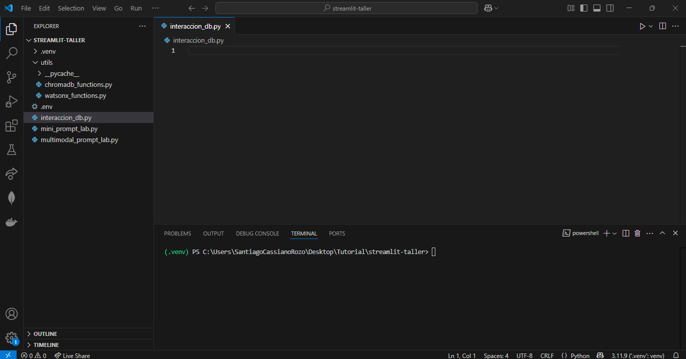

### Paso 5.4: Crear la lógica para la aplicación.

Dentro del archivo _interaccion_db.py_ se debe copiar el siguiente código, el cual contiene la lógica de la aplicación completa:

```python
import streamlit as st
from utils.chromadb_functions import *

st.title("Interaccion con la base de datos vectorial")

operaciones = ["Agregar un documento", "Ver documentos guardados", "Eliminar un documento", "Realizar una consulta a la base de datos"]

operacion_seleccionada = st.pills("Selecciona una operacion a realizar en la base de datos", operaciones)

if operacion_seleccionada == "Agregar un documento":
    identificador_a_agregar = st.text_input("Identificador para el documento a agregar", placeholder="Escribe aquí el identificador")
    documento_a_agregar = st.text_area("Documento a agregar", placeholder="Escribe aquí el documento que quieres agregar a la base de datos")

    boton_agregar = st.button("Agregar documento")
    if boton_agregar:
        agregar_documento_bd(identificador_a_agregar, documento_a_agregar)
        st.success("Documento agregado exitosamente a la base de datos")

elif operacion_seleccionada == "Ver documentos guardados":
    resultados = obtener_todos_los_documentos_bd()
    if len(resultados['ids']) == 0:
        st.warning("No hay documentos guardados en la base de datos")
    else:
        #Se realiza un bucle para recorrer los documentos y mostrarlos
        #Se recorre cada uno de los ids y se muestra el id en el titulo del contendor
        # y dentro del contendor se muestra el documento almacenado asociado a ese id
        for index in range(len(resultados['ids'])):
            with st.expander(f"ID: _{resultados['ids'][index]}_", expanded=False): 
                st.write(resultados['documents'][index])

elif operacion_seleccionada == "Eliminar un documento":
    #Se obtienen los documentos guardados
    resultados = obtener_todos_los_documentos_bd()

    #Se obtiene la lista de identificadores de los documentos guardados
    lista_ids = resultados['ids']

    #Se muestra la lista de identificadores en un menu tipo dropdown
    identificador_seleccionado = st.selectbox("Selecciona el identificador del documento a eliminar",lista_ids)

    #Si se selecciono un identificador
    if identificador_seleccionado is not None:
        boton_eliminar = st.button("Haz clic aquí para eliminar el documento seleccionado", on_click=eliminar_documento_segun_id_bd, args=[identificador_seleccionado])


elif operacion_seleccionada == "Realizar una consulta a la base de datos":
    #Mostar un documento en pantalla
    st.write("Escribe una consulta y observa cuales son los documentos con menor distancia al texto de la consulta")

    #Crear un text area para que el usuario pueda escribir su consulta
    texto_consulta = st.text_area("Escribe el texto con el cual realizar la consulta a la base de datos")

    #Crear un number_input para que el usuario pueda decir máximo cuantos resultados quiere obtener
    max_resultados = st.number_input("Ingresa la cantidad maxima de resultados que quieres obtener", min_value=1, value=3)

    #Crear un boton para realizar la consulta
    boton_realizar_consulta = st.button("Realizar la consulta")
    if boton_realizar_consulta:
        #Llamar la función para realizar la consulta a la base de datos
        resultados = realizar_consulta_a_la_bd(texto_consulta, max_resultados)
        #Si hubo 0 resultados, decir en pantalla
        if len(resultados['ids']) == 0:
            st.warning("No se encontraron documentos")
        
        #Si hubo resultados, mostrarlos en un contenedor cada uno, indicando su id, distancia y contenido
        for index in range(len(resultados['ids'][0])):
            with st.expander(f"ID: _{resultados['ids'][0][index]}_ ↔️ Distancia respecto a la consulta: {resultados['distances'][0][index]}", expanded=False): 
                st.write(resultados['documents'][0][index])
```

### Paso 5.5: Explicación de la lógica de la aplicación

En esta sección no se contruyo la aplicación paso a paso debido a que se usan varios elementos ya conocidos pero hay algunas cosas novedosas que se pueden explicar.

1. Se utiliza un elemento de tipo [st.pills()](https://docs.streamlit.io/develop/api-reference/widgets/st.pills) para que el usuario pueda elegir cual operación quiere realizar sobre la base de datos vectorial.

2.  Si la operación seleccionada es "Agregar un documento" el usuario podra ingresar el identificador y el documento a agregar en la aplicación. Cuando oprima un botón se llamará a la función _agregar_documento_bd()_ para insertar la información en la base de datos. Finalmente se muestra un mensaje indicando que la operación fue exitosa con el elemento [st.success](https://docs.streamlit.io/develop/api-reference/status/st.success)

3. Si el usuario elige "Ver documentos guardados" entonces se llamara a la función encargada de traer los documentos guardados. La funcion _obtener_todos_los_documentos_bd()_ retorna un diccionario del siguiente estilo (El diccionario contiene más datos, pero estos son los relevantes para esta aplicación):

    ```python
    {
        'ids':['id1','id2',...],
        'documents':['documento1','documento2',...]
    }
    ```
    Para mostrar todos los documentos se recorre la lista de _ids_ y _documents_. Mostrando cada Id junto a su documento asociado.

4. Si el usuario elige la operacion "Eliminar un documento" se muestra un menú st con los ids de los documentos guardados. El usuario puede elegir un id y luego dar click a un boton para eliminarlo. Cuando se hace click este boton llama a la función _eliminar_documento_segun_id_bd()_ le pasa como argumento el id seleccionado por el usuario.

5. Finalmente si se elige la operación "Realizar una consulta a la base de datos" entonces aparecera un espacio donde el usuario puede escribir su consutla y seleccionar la cantidad máxima de resultados que quiere obtener. 
    
    Luego el usuario puede oprimir un boton para realizar la consulta. La funcion _realizar_consulta_a_la_bd()_ retorna los resultados en un diccionario del siguiente estilo:

    ```python
    {
        'ids':[['id1','id2',...]],
    'documents':[['documento1','documento2',...]],
        'distances':[[0.6,0.9,...]]
    }
    ```

    Este diccionario se recorre para mostrar el id, el documento y la distancia del embedding del documento al embbeding del texto de la consulta del usuario.

### Paso 5.6: Ejecutar la aplicación

Si ya se han instalado las librerias, entonces se puede ejecutar el siguiente comando en la terminal para ejecutar la aplicación:

```python
streamlit run interaccion_db.py
```

A continuación se muestra un video ejemplificando cada una de las operaciones(Es posible que la primera operación que se realice varios segundos debido a que realiza la conexión inicial con la base de datos):

- Agregar documentos y Ver documentos guardados:

- Eliminar un documento:

- Realizar una consulta a la base de datos: