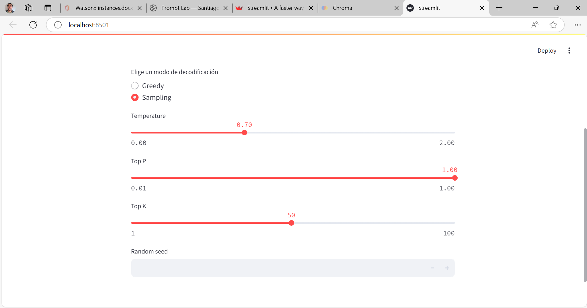

# Taller practico sobre Streamlit.

Este taller tiene como objetivo crear una aplicación de Streamlit en donde se pueda interactuar con modelos de inteligencia artificial generativa alojados en WatsonX, con una base de datos vectorial de ChromaDB y crear un RAG que permita consultar los documentos guardados en la base de datos vectorial.

## Prerrequisitos.
- Tener instalado Python. (La versión recomendada es **Python 3.11.9**. Esto debido a que en las versiones 3.12 y 3.13 se requiere descargar las Visual Studio Build Tools para poder instalar las dependencias de la app)
- (Opcional pero muy recomendable) Tener instalado Visual Studio Code.


## Paso 0: Preparación e Instalación de Streamlit.

### Paso 0.1: Crear una carpeta para almacenar el código de la aplicación.


### Paso 0.2: Abrir la carpeta con un editor de código (Se recomienda Visual Studio Code).


### Paso 0.3: Abrir una consola ubicada en la carpeta del proyecto.


### Paso 0.4: Verificar las versiones de Python instaladas en el computador.

Para listar las versiones de Python se puede ejecutar el siguiente comando en la consola.

```console
py --list
```

En la consola se deberia ver una lista de las versiones de Python instaladas. Por ejemplo, esta seria la respuesta en caso de tener instaladas las versiones 3.11 y 3.12:


### Paso 0.5: Crear un entorno virtual de Python.

Un entorno virtual de python es una carpeta donde se tiene una versión de Python y paquetes instalados de forma aislada a la instalación principal de Python que se tiene en todo el sistema.

Para crear un entorno virtual que tenga nombre _.venv_ se debe usar el siguiente comando, donde la X se debe remplazar por la versión de Python con la que se quiere crear el entorno virtual

```console
py -3.X -m venv .venv
```

Por ejemplo, en caso de crear un entorno virtual de Python 3.11 (que es la version recomendada) se usaria el comando:

```console
py -3.11 -m venv .venv
```

Tras ejecutar el comando se debio crear una carpeta llamada _.venv_ en el proyecto, esta carpeta corresponde al entorno virtual que se usará para el proyecto:


### Paso 0.6: Activar el entorno virtual en la terminal

En la terminal ubicada en la carpeta del proyecto se debe ejecutar alguno de los siguientes comandos para activar el entorno virtual.

En caso de tener una terminal de Powershell utilizar el comando:

```console
.\.venv\Scripts\activate.ps1
```

En caso de tener una terminal de comandos de Windows (CMD) utilziar el comando: 
```console
.\.venv\Scripts\activate.bat
```

Tras ejecutar el comando, en la parte izquierda de la terminal deberia verse el nombre del entorno virtual que fue activado:


Al tener el entorno virtual activado en la terminal, todos los paquetes que se instalen desde la terminal unicamente serán almacenados en el entorno virtual, no en la instalación de Python de todo el sistema.

### Paso 0.7: Instalar Streamlit en el entorno virtual

Para instalar Streamlit se debe utilizar el siguiente comando en la terminal que tiene el entorno virtual activado:

```console
pip install streamlit==1.44.1
```

Tras ejecutar el comando empezarán a descargarse e instalarse todas las librerias necesarias para Streamlit. Este proceso puede tardar unos minutos.

## Paso 1: Crear un Hola Mundo en Streamlit.

### Paso 1.1: Crear el archivo _hola_mundo.py_

Las aplicaciones de Streamlit se basan en archivos de Python. Es por ello que lo primero que se debe hacer para crear una aplicación de Streamlit es crear un archivo Python. Para este taller se debe crear un archivo llamado _hola_mundo.py_ dentro de la carpeta del proyecto:


### Paso 1.2: Agregar el mensaje _Hola Mundo_ a la aplicación

Para que la aplicación muestre el mensaje _Hola Mundo_ se deben escribir las siguientes lineas de código en el archivo _hola_mundo.py_

```python
import streamlit as st

st.write("Hola Mundo")
```

La primera linea del código se encarga de importar la libreria streamlit y permite utilizarla bajo el nombre _st_. La segunda linea utiliza el elemento [st.write()](https://link-url-here.org) de Streamlit. Este elemento permite mostrar en la pantalla de la aplicación el texto que recibe como argumento.

Tras escribir este código se debe guardar el archivo _hola_mundo.py_

### Paso 1.3: Ejecutar la aplicación _hola_mundo.py_

Para ejecutar la aplicación se debe utilizar el siguiente comando en la terminal que tiene activado el entorno virtual:

```console
streamlit run hola_mundo.py
```

Al ejecutar el comando debio abrirse una ventana del navegador en la URL http://localhost:8501 

Dentro de esta ventana deberia verse el mensaje 'Hola Mundo':


En la parte superior de la pantalla aparece el boton _Deploy_ y un botón de opciones. Estos [botones](https://docs.streamlit.io/develop/concepts/architecture/app-chrome) son creados automaticamente por Streamlit y tienen funcionalidades más avanzadas que no se van a cubrir en este taller.

Con estos pasos se ha creado un Hola Mundo en Streamlit.

## Paso 2: Crear una aplicación para saludar con un boton.

### Paso 2.1: Agregar un boton a la aplicación.

Para agregar un boton a la aplicación se debe usar el elemento [st.button()](https://docs.streamlit.io/develop/api-reference/widgets/st.button). Este elemento permite dibujar un botón en la pantalla y cada vez que dicho boton sea oprimido la función st.button() retornará el valor True.

Para incluir en la aplicación un botón que muestre el mensaje _Hola Mundo_ al ser presionado se debe modificar el código del archivo _hola_mundo.py_ de la siguiente forma:

```python
import streamlit as st

boton_saludar = st.button("Saludar")

if boton_saludar:
    #Esta parte del código se ejecuta cuando se presiona el boton
    st.write("Hola Mundo")
```

En esta modificación se ha incluido un st.button. El primer argumento del st.button es el texto que se quiere mostrar sobre el botón.

El botón creado se ha asignado a la variable _boton_saludar_. La variable _boton_saludar_ tomará el valor True cuando el botón sea presionado por el usuario, y cuando esto pase se ejecutará el código dentro de la sentencia _if_, lo cual hará que se escriba el mensaje _Hola Mundo_ en la pantalla.

Una vez se han guardado estos cambios en el archivo _hola_mundo.py_ se puede ir nuevamente a la dirección http://localhost:8501 en el navegador.

Al entrar se deberia seguir viendo unicamente el mensaje _Hola Mundo_, esto ocurre debido a que el navegador aún no ha vuelto a ejecutar la aplicación con los ultimos los cambios realizados en el archivo _hola_mundo.py_.

Para que el navegador vuelva a ejecutar la aplicación y refleje los ultimos cambios del código se tienen dos opciones:

1. Oprimir la tecla R dentro del navegador.

2. Ubicar el cursor sobre el logo _i_ que aparece en la esquina superior derecha de la pantalla y luego dar click al boton _Rerun_:

https://github.com/user-attachments/assets/3c6c8a82-aa81-4837-b97a-b40cf16dea6d

Tras esto, en el navegador se ven los ultimos cambios realizados en la aplicación y ahora aparece el botón _Saludar_ en la pantalla. Cuando se oprime el boton se muestra el mensaje _Hola Mundo_:

https://github.com/user-attachments/assets/79f6f154-012d-4daa-966b-42e6cb7f01a1

### Paso 2.2: Agregar un campo de texto para escribir un nombre

Ahora vamos a modificar el código de la aplicación para que se pueda recibir el nombre del usuario y se puede escribir un mensaje saludandolo tras oprimir un boton.

Para esto debemos modificar el código dentro del archivo _hola_mundo.py_ para que se vea de la siguiente manera:

```python
import streamlit as st

nombre_usuario = st.text_input("Escribe tu nombre")

boton_saludar = st.button("Saludar")

if boton_saludar:
    #Esta parte del código se ejecuta cuando se presiona el boton
    st.write(f"Hola {nombre_usuario}")
```

En este caso se ha agregado un elemento de tipo [st.text_input()](https://docs.streamlit.io/develop/api-reference/widgets/st.text_input) al inicio de la aplicación. Este elemento dibuja una caja de texto donde el usuario puede escribir. El primer argumento del st.text_input() corresponde al mensaje que se quiere mostrar en pantalla sobre la caja de texto.

La variable _nombre_usuario_ va a almacenar el texto que se escriba en la caja de texto dibujada por el elemento st.text_input. 

Por otra parte, ahora el mensaje que se escribe en pantalla con st.write va a incluir el _nombre_usuario_ que se haya escrito en la caja de texto.

Para visualizar todos estos elementos se deben guardar los cambios del archivo _hola_mundo.py_ y se debe ir al navegador. Tras dar click al boton _Rerun_ se deberia ver la siguiente interfaz:

https://github.com/user-attachments/assets/29ec2a30-f612-4afc-81c9-de6cd1d7dc32

Esta interfaz contiene los elementos que se mencionaron anteriormente y permite mostrar un saludo al usuario al oprimir el boton _Saludar_.

### Paso 2.3: Detener la aplicación

Para detener la aplicación de Streamlit se debe ir a la terminal donde se esta ejecutando la aplicación y oprimir CTRL+C. 

**Es importante que durante este proceso no se cierre la ventana del navegador** donde se estaba viendo la aplicación, ya que si la ventana del navegador se encuentra cerrada, la aplicación no se va a detener con CTRL+C.

Video ejemplo sobre cómo se ve la terminal tras detener la aplicación exitosamente:

https://github.com/user-attachments/assets/a8eb70fa-b605-44ea-8723-e643f17196ef

### Paso 2.4: Conclusión

En esta sección se pudo ver que por medio de los elementos que ofrece Streamlit se pudo crear una aplicación que puede recibir el nombre de un usuario y saludarlo con tan solo 9 lineas de código.

Streamlit acelera mucho el desarrollo de aplicaciones web debido a que permite incluir facilmente elementos en la interfaz simplemente llamando sus funciones dentro del código Python. 

Cabe resaltar que Streamlit tiene una amplia [biblioteca de elementos](https://docs.streamlit.io/develop/api-reference) que se pueden utilizar para mostrar diversos tipos de textos o graficas. Tambien tiene varios elementos para recibir distintos tipos de inputs.

La idea de esta primera parte del taller era familiarizarse con la forma en que se suelen llamar los elementos de Streamlit y cómo estos se ven reflejados en la interfaz grafica.


## Paso 3: Crear un Mini Prompt Lab

En esta sección del taller se busca crear una versión reducida de la sección Freeform del Prompt Lab de WatsonX que se vio en la sesión teorica del jueves.


Dentro de esta aplicación se podrá llamar a un modelo generativo alojado en la plataforma WatsonX utilizando los parametros que prefiera el usuario.

### Paso 3.1: Eliminar el archivo _hola_mundo.py_

### Paso 3.2: Crear un nuevo archivo llamado _mini_prompt_lab.py_.

Tras realizar estos cambios, la carpeta del proyecto deberia verse de la siguiente forma.


### Paso 3.3: Agregar un titulo a la aplicación.

En Streamlit se puede usar el elemento [st.title()](https://docs.streamlit.io/develop/api-reference/text/st.title) para mostrar un texto con formato de titulo dentro de la aplicación.

Para incluir un titulo en el Mini Prompt Lab se debe escribir el siguiente código en el archivo _mini_prompt_lab.py_

```python
import streamlit as st

st.title("Mini Prompt Lab")
```

Para ejecutar la aplicación se debe ejecutar el siguiente comando en la terminal.

```console
streamlit run mini_prompt_lab.py
```

Tras ejecutar la aplicación en el navegador deberia verse lo siguiente.


### Paso 3.4: Agregar un menu para elegir el modelo.

Para agrear un menu en el cual se pueda elegir uno de los modelos disponibles en WatsonX se puede utilizar un elemento [st.selectbox()](https://docs.streamlit.io/develop/api-reference/widgets/st.selectbox). Este elemento crea un menu tipo dropdown en el cual se puede elegir entre una lista de opciones.

Para incluir este menu en la aplicación se debe modificar el código en _mini_prompt_lab.py_ de la siguiente manera:

```python
import streamlit as st

st.title("Mini Prompt Lab")

modelo_seleccionado = st.selectbox("Elige el modelo que quieres utilizar", ["ibm/granite-3-2-8b-instruct","mistralai/mistral-large", "meta-llama/llama-3-3-70b-instruct", "meta-llama/llama-4-scout-17b-16e-instruct", "meta-llama/llama-4-maverick-17b-128e-instruct-fp8"])
```

La variable _modelo_seleccionado_ va a almacenar el modelo que elija el usuario desde la interfaz grafica. En este caso en el st.selectbox se incluyen 5 modelos a elegir para el usuario (Granite 3.2 8b, Mistral Large, Llama 3.3 70b, Llama 4 Scout, Llama 4 Maverick).

Si se ingresa nuevamente a la aplicación en el navegador, ahora debe haber un menu donde se puede elegir el modelo:


### Paso 3.5: Agregar espacios para indicar la cantidad mínima y máxima de tokens de respuesta.

Streamlit permite al usuario ingresar números por medio del elemento [st.number_input()](https://docs.streamlit.io/develop/api-reference/widgets/st.number_input).

Para que el usuario un st.number_input() para que el usuario pueda indicar la cantidad mínima de tokens y otro para que pueda indicar la cantiadad máxima de tokens que espera de respuesta. 

Para esto se debe modificar el código escrito en _mini_prompt_lab.py_ de la siguiente forma.

```python
import streamlit as st

st.title("Mini Prompt Lab")

modelo_seleccionado = st.selectbox("Elige el modelo que quieres utilizar", ["ibm/granite-3-2-8b-instruct","mistralai/mistral-large", "meta-llama/llama-3-3-70b-instruct", "meta-llama/llama-4-scout-17b-16e-instruct", "meta-llama/llama-4-maverick-17b-128e-instruct-fp8"])

min_tokens_seleccionados = st.number_input("Tokens de respuesta mínimos", min_value=0)

max_tokens_seleccionados = st.number_input("Tokens de respuesta máximos", min_value=0, value=200)
```

Las variables _min_tokens_seleccionados_ y _max_tokens_seleccionados_ almacenarán el número que ingrese el usuario en sus respectivos st.number_input().

Tras estos cambios, la aplicación en el navegador debe verse de la siguiente forma:


### Paso 3.6: Agregar un menu para seleccionar el modo de decodificación

Para que en la aplicación el usuario peuda seleccionar entre utilizar el modo de decodificación "Greedy" o "Sampling" se puede utilizar un menu del tipo [st.radio()](https://docs.streamlit.io/develop/api-reference/widgets/st.radio). Este menu permite al usuario elegir una entre varias opciones.

El código en el archivo _mini_prompt_lab.py_ se debe modificar de la siguiente manera para incluir un menu que permita seleccionar el modo de decodificación:

```python
import streamlit as st

st.title("Mini Prompt Lab")

modelo_seleccionado = st.selectbox("Elige el modelo que quieres utilizar", ["ibm/granite-3-2-8b-instruct","mistralai/mistral-large", "meta-llama/llama-3-3-70b-instruct", "meta-llama/llama-4-scout-17b-16e-instruct", "meta-llama/llama-4-maverick-17b-128e-instruct-fp8"])

min_tokens_seleccionados = st.number_input("Tokens de respuesta mínimos", min_value=0)

max_tokens_seleccionados = st.number_input("Tokens de respuesta máximos", min_value=0, value=200)

modo_seleccionado = st.radio("Elige un modo de decodificación", ["Greedy", "Sampling"])
```

Tras este cambio, la aplicación en el navegador debe verse de la siguiente forma:


### Paso 3.7: Agregar los parametros para el modo Sampling.

Cuando se selecciona el modo Sampling en el Prompt Lab se permite al usuario configurar parametros adicionales cómo lo son la temperatura, el top p, el top k y la random seed para la generación del texto:


En la aplicación se van a agregar elementos del tipo [st.slider()](https://docs.streamlit.io/develop/api-reference/widgets/st.slider) para que el usuario pueda seleccionar la temperatura, top p  y top k cuando tenga seleccionado el modo "Sampling". Además se va a agregar un st.number_input() para que indique la random seed a utilizar.

Para incluir esta lógica en la aplicación, se debe modificar el archivo _mini_prompt_lab.py_ para que quede de la siguiente forma:

```python
import streamlit as st

st.title("Mini Prompt Lab")

modelo_seleccionado = st.selectbox("Elige el modelo que quieres utilizar", ["ibm/granite-3-2-8b-instruct","mistralai/mistral-large", "meta-llama/llama-3-3-70b-instruct", "meta-llama/llama-4-scout-17b-16e-instruct", "meta-llama/llama-4-maverick-17b-128e-instruct-fp8"])

min_tokens_seleccionados = st.number_input("Tokens de respuesta mínimos", min_value=0)

max_tokens_seleccionados = st.number_input("Tokens de respuesta máximos", min_value=0, value=200)

modo_seleccionado = st.radio("Elige un modo de decodificación", ["Greedy", "Sampling"])

if modo_seleccionado == "Sampling":
    temperature_seleccionada = st.slider("Temperature", min_value=0.00, max_value=2.00, value=0.7, step=0.01)
    top_p_seleccionado = st.slider("Top P", min_value=0.01, max_value=1.00, value=1.00, step=0.01)
    top_n_seleccionado = st.slider("Top K", min_value=1, max_value=100, value=50, step=1)
    random_seed_seleccionada = st.number_input("Random seed", min_value=1)
```

Los elementos de tipo st.slider() retornan el valor que el usuario haya seleccionado desde la interfaz.

Tras guardar los cambios realizados, en el navegador al seleccionar la opción "Sampling" deberian salir los siguientes elementos:



### Paso 3.8: Agregar un slider para el parametro Repetition Penalty

Al final del código se va a agregar otro st.slider() con el cual se pueda seleccionar el valor de repetition penalty tanto cuando se selecciona el modo "Greedy" cómo cuando se selecciona el modo "Sampling".

Para ello se debe modificar el código de _mini_prompt_lab.py_ de la siguiente forma:

```python
import streamlit as st

st.title("Mini Prompt Lab")

modelo_seleccionado = st.selectbox("Elige el modelo que quieres utilizar", ["ibm/granite-3-2-8b-instruct","mistralai/mistral-large", "meta-llama/llama-3-3-70b-instruct", "meta-llama/llama-4-scout-17b-16e-instruct", "meta-llama/llama-4-maverick-17b-128e-instruct-fp8"])

min_tokens_seleccionados = st.number_input("Tokens de respuesta mínimos", min_value=0)

max_tokens_seleccionados = st.number_input("Tokens de respuesta máximos", min_value=0, value=200)

modo_seleccionado = st.radio("Elige un modo de decodificación", ["Greedy", "Sampling"])

if modo_seleccionado == "Sampling":
    temperature_seleccionada = st.slider("Temperature", min_value=0.00, max_value=2.00, value=0.7, step=0.01)
    top_p_seleccionado = st.slider("Top P", min_value=0.01, max_value=1.00, value=1.00, step=0.01)
    top_n_seleccionado = st.slider("Top K", min_value=1, max_value=100, value=50, step=1)
    random_seed_seleccionada = st.number_input("Random seed", min_value=1)

repetition_penalty_seleccionada = st.slider("Repetition Penalty", min_value=1.00, max_value=2.00, value=1.00, step=0.01)
```

Tras agregar este elemento, en la parte de abajo de la aplicación deberia salir un slider para seleccionar el valor de repetition penalty:


### Paso 3.9: Agregar un espacio para el prompt y un boton para llamar al modelo.

Para agregar un espacio donde el usuario pueda escribir el prompt se va a utilizar un elemento del tipo [st.text_area()](https://docs.streamlit.io/develop/api-reference/widgets/st.text_area). Además, se va a agregar al final un botón con el cual llamar al modelo con el prompt y los parametros seleccionados.

Para esto se debe modificar el código del archivo _mini_prompt_lab.py_ para que quede de la siguiente forma:

```python
import streamlit as st

st.title("Mini Prompt Lab")

modelo_seleccionado = st.selectbox("Elige el modelo que quieres utilizar", ["ibm/granite-3-2-8b-instruct","mistralai/mistral-large", "meta-llama/llama-3-3-70b-instruct", "meta-llama/llama-4-scout-17b-16e-instruct", "meta-llama/llama-4-maverick-17b-128e-instruct-fp8"])

min_tokens_seleccionados = st.number_input("Tokens de respuesta mínimos", min_value=0)

max_tokens_seleccionados = st.number_input("Tokens de respuesta máximos", min_value=0, value=200)

modo_seleccionado = st.radio("Elige un modo de decodificación", ["Greedy", "Sampling"])

if modo_seleccionado == "Sampling":
    temperature_seleccionada = st.slider("Temperature", min_value=0.00, max_value=2.00, value=0.7, step=0.01)
    top_p_seleccionado = st.slider("Top P", min_value=0.01, max_value=1.00, value=1.00, step=0.01)
    top_n_seleccionado = st.slider("Top K", min_value=1, max_value=100, value=50, step=1)
    random_seed_seleccionada = st.number_input("Random seed", min_value=1)

repetition_penalty_seleccionada = st.slider("Repetition Penalty", min_value=1.00, max_value=2.00, value=1.00, step=0.01)

prompt_del_usuario = st.text_area("Prompt", placeholder="Escribe aquí tu prompt")

boton_llamar_modelo = st.button("Llamar al modelo")
```

La variable _prompt_del_usuario_ va a almacenar el texto que el usuario escriba en el area de texto que se muestra en la aplicación.

Tras estos cambios, en la parte de abajo de la aplicación deberian verse los siguientes elementos:


Hasta el momento se ha adelantado la mayor parte de la interfaz del Mini Prompt Lab. A continuación se va a escribir el código que va permitir llamar los modelos alojados en WatsonX.

### Paso 3.10: Instalar una libreria para llamar a WatsonX


